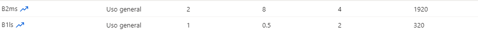
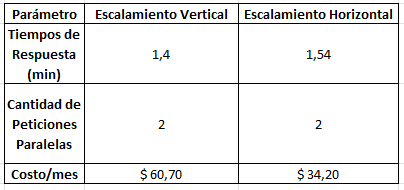

### Escuela Colombiana de Ingeniería
### Arquitecturas de Software - ARSW

### Desarrollado por: Daniel Santiago Gómez Zabala

## Escalamiento en Azure con Maquinas Virtuales, Sacale Sets y Service Plans

### Dependencias
* Cree una cuenta gratuita dentro de Azure. Para hacerlo puede guiarse de esta [documentación](https://azure.microsoft.com/es-es/free/students/). Al hacerlo usted contará con $100 USD para gastar durante 12 meses.

### Parte 0 - Entendiendo el escenario de calidad

Adjunto a este laboratorio usted podrá encontrar una aplicación totalmente desarrollada que tiene como objetivo calcular el enésimo valor de la secuencia de Fibonnaci.

**Escalabilidad**
Cuando un conjunto de usuarios consulta un enésimo número (superior a 1000000) de la secuencia de Fibonacci de forma concurrente y el sistema se encuentra bajo condiciones normales de operación, todas las peticiones deben ser respondidas y el consumo de CPU del sistema no puede superar el 70%.

### Parte 1 - Escalabilidad vertical

1. Diríjase a el [Portal de Azure](https://portal.azure.com/) y a continuación cree una maquina virtual con las características básicas descritas en la imágen 1 y que corresponden a las siguientes:
    * Resource Group = SCALABILITY_LAB
    * Virtual machine name = VERTICAL-SCALABILITY
    * Image = Ubuntu Server 
    * Size = Standard B1ls
    * Username = scalability_lab
    * SSH publi key = Su llave ssh publica

    

    Se realizo la creación de la máquina virtual en azure

    .png)

2. Para conectarse a la VM use el siguiente comando, donde las `x` las debe remplazar por la IP de su propia VM (Revise la sección "Connect" de la virtual machine creada para tener una guía más detallada).

    `ssh scalability_lab@xxx.xxx.xxx.xxx`

    Nos conectamos a la máquina virtual usando el comando anterior, usando la clave del SSH que se debió descargar previamente 

    

3. Instale node, para ello siga la sección *Installing Node.js and npm using NVM* que encontrará en este [enlace](https://linuxize.com/post/how-to-install-node-js-on-ubuntu-18.04/).
4. Para instalar la aplicación adjunta al Laboratorio, suba la carpeta `FibonacciApp` a un repositorio al cual tenga acceso y ejecute estos comandos dentro de la VM:

    `git clone <your_repo>`

    `cd <your_repo>/FibonacciApp`

    `npm install`

5. Para ejecutar la aplicación puede usar el comando `npm FibinacciApp.js`, sin embargo una vez pierda la conexión ssh la aplicación dejará de funcionar. Para evitar ese compartamiento usaremos *forever*. Ejecute los siguientes comando dentro de la VM.

    ` node FibonacciApp.js`

    Iniciamos la apliación con el comando anterior

    

6. Antes de verificar si el endpoint funciona, en Azure vaya a la sección de *Networking* y cree una *Inbound port rule* tal como se muestra en la imágen. Para verificar que la aplicación funciona, use un browser y user el endpoint `http://xxx.xxx.xxx.xxx:3000/fibonacci/6`. La respuesta debe ser `The answer is 8`.

    

    Después de configurar el puerto por el cual se iba a ver la aplicación e ingresar la URL indicada, vemos el resultado en la siguiente imagen:

    

7. La función que calcula en enésimo número de la secuencia de Fibonacci está muy mal construido y consume bastante CPU para obtener la respuesta. Usando la consola del Browser documente los tiempos de respuesta para dicho endpoint usando los siguintes valores:
    * 1000000
    
    * 1010000
    
    * 1020000
    
    * 1030000
    
    * 1040000
    
    * 1050000
    
    * 1060000
    
    * 1070000
    
    * 1080000
    
    * 1090000    
    

8. Dírijase ahora a Azure y verifique el consumo de CPU para la VM. (Los resultados pueden tardar 5 minutos en aparecer).

    

    Vemos el rendimiento de la CPU como lo indica el punto

    

9. Ahora usaremos Postman para simular una carga concurrente a nuestro sistema. Siga estos pasos.
    * Instale newman con el comando `npm install newman -g`. Para conocer más de Newman consulte el siguiente [enlace](https://learning.getpostman.com/docs/postman/collection-runs/command-line-integration-with-newman/).
    * Diríjase hasta la ruta `FibonacciApp/postman` en una maquina diferente a la VM.
    * Para el archivo `[ARSW_LOAD-BALANCING_AZURE].postman_environment.json` cambie el valor del parámetro `VM1` para que coincida con la IP de su VM.

        Se cambio además en el collection el parametro VM1, acá las pruebas:

        
        

    * Ejecute el siguiente comando.
        ```
        newman run ARSW_LOAD-BALANCING_AZURE.postman_collection.json -e [ARSW_LOAD-BALANCING_AZURE].postman_environment.json -n 10 &
        newman run ARSW_LOAD-BALANCING_AZURE.postman_collection.json -e [ARSW_LOAD-BALANCING_AZURE].postman_environment.json -n 10
        ```

        Se ejecuto el comando anterior y se obtuvo el siguiente resultado:

        

        

10. La cantidad de CPU consumida es bastante grande y un conjunto considerable de peticiones concurrentes pueden hacer fallar nuestro servicio. Para solucionarlo usaremos una estrategia de Escalamiento Vertical. En Azure diríjase a la sección *size* y a continuación seleccione el tamaño `B2ms`.

    

    Se realiza el cambio de la CPU sugerido en el punto

    

11. Una vez el cambio se vea reflejado, repita el paso 7, 8 y 9.

    **Punto 7**

    * 1000000
    
    * 1010000
    
    * 1020000
    
    * 1030000
    
    * 1040000
    
    * 1050000
    
    * 1060000
    
    * 1070000
    
    * 1080000
    
    * 1090000    
    

    **Punto 8**

    

    **Punto 9**

    
    

12. Evalue el escenario de calidad asociado al requerimiento no funcional de escalabilidad y concluya si usando este modelo de escalabilidad logramos cumplirlo.

    Si comparamos el consumo de CPU antes y después de haber realizado el requerimiento no funcional de escalabilidad, se puede concluir que si se logro ya que hubo una notable disminución el consumo de la mísma.

    

13. Vuelva a dejar la VM en el tamaño inicial para evitar cobros adicionales.

**Preguntas**

1. ¿Cuántos y cuáles recursos crea Azure junto con la VM?

    Se crearón dos recursos:

    

    Un grupo de recursos y una VM (Virtual Machine)

2. ¿Brevemente describa para qué sirve cada recurso?

    **El grupo de recursos:** Nos permitira demilimitar los recursos que se crearán, en este caso la máquina virtual, esto también contribuye en una facilidad de configuración de los recursos que contiene.

    **Máquina Virtual:** Acá se desarrollará el laboratorio, dentro de esta podremos obtener una IP que en este caso la asignada fue 20.127.146.164, podemos configurar según se solicite y demás.

3. ¿Al cerrar la conexión ssh con la VM, por qué se cae la aplicación que ejecutamos con el comando `npm FibonacciApp.js`? ¿Por qué debemos crear un *Inbound port rule* antes de acceder al servicio?

    Al cerrar la conexión SSH con la VM, la aplicación que se está ejecutando en la VM deja de recibir conexiones desde el exterior. Esto se debe a que la conexión SSH proporciona la única forma de acceder a la VM desde el exterior. Cuando cierra la conexión SSH, se cierra el túnel que permite que las conexiones desde el exterior lleguen a la VM. Además es necesario crear un InBound port Rule, ya que dentro de los puertos de la VM este puerto no se encuentra abierto para recibir peticiones de la apliación y transmitirlas.

4. Adjunte tabla de tiempos e interprete por qué la función tarda tando tiempo.

    

    En este caso la diferencia notable entre los dos tamaños ya que con B1ls se realizo en una máquina diferentes que con B2ms; sin embargo se podria interpretar que el cálculo que realiza por debajo hace que el consumo de CPU sea mucho mayor.

5. Adjunte imágen del consumo de CPU de la VM e interprete por qué la función consume esa cantidad de CPU.

    

    Se puede concluir que la función consume esa cantidad de CPU por el tamaño de la VM en memoria, haciendo referencia a la configuración que se realizo inicialmente.

6. Adjunte la imagen del resumen de la ejecución de Postman. Interprete:

    * Tiempos de ejecución de cada petición.

        

    * Si hubo fallos documentelos y explique.
7. ¿Cuál es la diferencia entre los tamaños `B2ms` y `B1ls` (no solo busque especificaciones de infraestructura)?

    
    

    Además de la notable diferencia entre el costo de usar uno u otra, B2ms cuenta con una RAM mucho mayor y un almacenamiento mayor.

8. ¿Aumentar el tamaño de la VM es una buena solución en este escenario?, ¿Qué pasa con la FibonacciApp cuando cambiamos el tamaño de la VM?

    En este escenario no es buena solución aumentar el tamaño de la VM, ya que la función no está bien construida. El consumo de la CPU presenta mejoría, pero el tiempo de respuesta no varía significativamente.

9. ¿Qué pasa con la infraestructura cuando cambia el tamaño de la VM? ¿Qué efectos negativos implica?

    Al cambiar el tamaño de B1ls a B2ms, el impacto más significativo es el precio, ya que si el tamaño es B1ls el precio es de 3.80 US$ mientras que B2ms el precio es de 60.74 US$.

10. ¿Hubo mejora en el consumo de CPU o en los tiempos de respuesta? Si/No ¿Por qué?

    En el consumo de CPU si hubo una mejora porque la VM tiene más recursos, pero en tiempo de respuesta no porque la aplicación no es óptima.

11. Aumente la cantidad de ejecuciones paralelas del comando de postman a `4`. ¿El comportamiento del sistema es porcentualmente mejor?

    Al aumentar la cantidad de ejecuciones paralelas podemos observar que el comportamiento del sistema es mucho mejor en términos de porcentaje comparandolo con el que se muetsra al inicio.

### Parte 2 - Escalabilidad horizontal

#### Crear el Balanceador de Carga

Antes de continuar puede eliminar el grupo de recursos anterior para evitar gastos adicionales y realizar la actividad en un grupo de recursos totalmente limpio.

1. El Balanceador de Carga es un recurso fundamental para habilitar la escalabilidad horizontal de nuestro sistema, por eso en este paso cree un balanceador de carga dentro de Azure tal cual como se muestra en la imágen adjunta.

    

    Realizamos la creación del balanceador de carga:

    

    En la siguiente imagen se mostrará la IP que fue asignada al balanceador de carga

    

2. A continuación cree un *Backend Pool*, guiese con la siguiente imágen.

    

    Se crea el backend pool:

    

3. A continuación cree un *Health Probe*, guiese con la siguiente imágen.

    

    Se creal el Healt Probe:

    

4. A continuación cree un *Load Balancing Rule*, guiese con la siguiente imágen.

    

    Se creal el Load Balancing Rule:

    

5. Cree una *Virtual Network* dentro del grupo de recursos, guiese con la siguiente imágen.

    

    Se crea el virtual Network:

    
    

#### Crear las maquinas virtuales (Nodos)

Ahora vamos a crear 3 VMs (VM1, VM2 y VM3) con direcciones IP públicas standar en 3 diferentes zonas de disponibilidad. Después las agregaremos al balanceador de carga.

**Según lo comentado en clase y las limitaciones que presentan las suscripción de AZURE únicamente se pudo realizar el montaje de VM**

1. En la configuración básica de la VM guíese por la siguiente imágen. Es importante que se fije en la "Avaiability Zone", donde la VM1 será 1, la VM2 será 2 y la VM3 será 3.

    

2. En la configuración de networking, verifique que se ha seleccionado la *Virtual Network*  y la *Subnet* creadas anteriormente. Adicionalmente asigne una IP pública y no olvide habilitar la redundancia de zona.

    

3. Para el Network Security Group seleccione "avanzado" y realice la siguiente configuración. No olvide crear un *Inbound Rule*, en el cual habilite el tráfico por el puerto 3000. Cuando cree la VM2 y la VM3, no necesita volver a crear el *Network Security Group*, sino que puede seleccionar el anteriormente creado.

    

4. Ahora asignaremos esta VM a nuestro balanceador de carga, para ello siga la configuración de la siguiente imágen.

    

5. Finalmente debemos instalar la aplicación de Fibonacci en la VM. para ello puede ejecutar el conjunto de los siguientes comandos, cambiando el nombre de la VM por el correcto

    Después de haber seguido los pasos de la guía, se crearon las dos máquina virtuales
    

    ```
    git clone https://github.com/daprieto1/ARSW_LOAD-BALANCING_AZURE.git

    curl -o- https://raw.githubusercontent.com/creationix/nvm/v0.34.0/install.sh | bash
    source /home/vm1/.bashrc
    nvm install node

    cd ARSW_LOAD-BALANCING_AZURE/FibonacciApp
    npm install

    npm install forever -g
    forever start FibonacciApp.js
    ```

    Clonamos el repositorio en las dos máquinas virtuales
    

    Se realizaron las intalaciones correspondientes y se puso a correr el servicio
    

Realice este proceso para las 3 VMs, por ahora lo haremos a mano una por una, sin embargo es importante que usted sepa que existen herramientas para aumatizar este proceso, entre ellas encontramos Azure Resource Manager, OsDisk Images, Terraform con Vagrant y Paker, Puppet, Ansible entre otras.


#### Probar el resultado final de nuestra infraestructura

1. Porsupuesto el endpoint de acceso a nuestro sistema será la IP pública del balanceador de carga, primero verifiquemos que los servicios básicos están funcionando, consuma los siguientes recursos:

    ```
    http://52.155.223.248/
    http://52.155.223.248/fibonacci/1
    ```

    
    

2. Realice las pruebas de carga con `newman` que se realizaron en la parte 1 y haga un informe comparativo donde contraste: tiempos de respuesta, cantidad de peticiones respondidas con éxito, costos de las 2 infraestrucruras, es decir, la que desarrollamos con balanceo de carga horizontal y la que se hizo con una maquina virtual escalada.

    **La prueba se realizo con dos máquinas a cada una se le analizó el consumo de su CPU**

    * VM1:
    
    
    * VM2:
    
    

3. Agregue una 4 maquina virtual y realice las pruebas de newman, pero esta vez no lance 2 peticiones en paralelo, sino que incrementelo a 4. Haga un informe donde presente el comportamiento de la CPU de las 4 VM y explique porque la tasa de éxito de las peticiones aumento con este estilo de escalabilidad.

    ```
    newman run ARSW_LOAD-BALANCING_AZURE.postman_collection.json -e [ARSW_LOAD-BALANCING_AZURE].postman_environment.json -n 10 &
    newman run ARSW_LOAD-BALANCING_AZURE.postman_collection.json -e [ARSW_LOAD-BALANCING_AZURE].postman_environment.json -n 10 &
    newman run ARSW_LOAD-BALANCING_AZURE.postman_collection.json -e [ARSW_LOAD-BALANCING_AZURE].postman_environment.json -n 10 &
    newman run ARSW_LOAD-BALANCING_AZURE.postman_collection.json -e [ARSW_LOAD-BALANCING_AZURE].postman_environment.json -n 10
    ```

    * VM1:

    

    

    * VM2:

    
    
    

**Preguntas**

* ¿Cuáles son los tipos de balanceadores de carga en Azure y en qué se diferencian?, ¿Qué es SKU, qué tipos hay y en qué se diferencian?, ¿Por qué el balanceador de carga necesita una IP pública?
    
    1. Existen tres categorías de balanceadores de carga que se diferencian según la capa de red en la que operan:

        **Balanceador de Carga de Nivel de Aplicación (Application Gateway)**

        Este tipo de balanceador opera en la capa 7 (capa de aplicación) del modelo OSI. Su función principal es dirigir el tráfico basándose en datos específicos de la aplicación, como la URL o los encabezados HTTP. Además, proporciona características avanzadas de seguridad, como el cifrado SSL y la protección contra ataques DDoS.

        **Balanceador de Carga de Tráfico de Red (Load Balancer)**

        Operando en la capa 4 (capa de transporte) del modelo OSI, este balanceador se utiliza para distribuir de manera equitativa el tráfico entrante entre los servidores de back-end. Puede equilibrar la carga según reglas definidas para IP, puerto y protocolo.

        **Gateway VPN (Virtual Private Network)**

        Este tipo de balanceador se emplea para establecer una conexión segura a través de una VPN entre una red virtual de Azure y una red local. Su configuración permite dirigir el tráfico de entrada y salida entre la red virtual y la red local, facilitando la integración de servicios en la nube y en las instalaciones.

        En resumen, el balanceador de carga de nivel de aplicación se centra en enrutar el tráfico según datos específicos de la aplicación, el balanceador de carga de tráfico de red se enfoca en distribuir uniformemente el tráfico entre los servidores de back-end, y el Gateway VPN proporciona conectividad segura y eficiente entre redes virtuales de Azure y redes locales.

    2. El SKU, o Stock Keeping Unit, es un identificador único asignado a un recurso en Azure para especificar sus características, capacidades y precios. Los diversos SKU permiten a los usuarios elegir la opción que mejor se adapte a sus necesidades, variando en términos de capacidad, escalabilidad, rendimiento y disponibilidad. Se aplican a una amplia gama de recursos, como máquinas virtuales, bases de datos, almacenamiento, servicios de red y otros servicios en la nube.

        **SKU de Máquina Virtual (Virtual Machine SKU)**
        Este tipo de SKU define las características y capacidades de una instancia de máquina virtual, como el número de núcleos de CPU, la cantidad de RAM, la capacidad de almacenamiento y el rendimiento de la red. Disponibles en categorías como uso general, optimizados para cómputo, memoria y almacenamiento.

        **SKU de Base de Datos (Database SKU)**
        Define las características y capacidades de una base de datos en Azure, como el tamaño de almacenamiento, el rendimiento y la disponibilidad. Se encuentran en categorías como uso general, optimizados para memoria y de alta disponibilidad.

        **SKU de Almacenamiento (Storage SKU)**
        Este tipo de SKU especifica las características y capacidades de un recurso de almacenamiento en Azure, incluyendo la capacidad de almacenamiento, el rendimiento de entrada/salida y la durabilidad de los datos. Disponibles en categorías como uso general, optimizados para rendimiento y para archivos.

        **SKU de Servicio de Red (Network Service SKU)**
        Define las características y capacidades de un servicio de red en Azure, como la capacidad de ancho de banda, la disponibilidad y la seguridad. Disponibles en categorías como uso general, optimizados para aplicaciones web y aplicaciones empresariales.

    3. Para posibilitar la comunicación de los clientes con los recursos de Azure ubicados detrás de un balanceador de carga, es esencial asignar una dirección IP pública al balanceador. Esta dirección IP pública actúa como punto de entrada para dirigir el tráfico de entrada hacia los recursos configurados en el conjunto de escalado detrás del balanceador. Sin esta asignación de dirección IP pública, el tráfico entrante carecería de una vía de enrutamiento, impidiendo así el acceso a los recursos ubicados detrás del balanceador de carga. En resumen, la asignación de una dirección IP pública al balanceador de carga es crucial para habilitar la conectividad y garantizar el acceso adecuado a los servicios en la nube.

* ¿Cuál es el propósito del *Backend Pool*?

    La función principal del Backend Pool es posibilitar que el balanceador de carga dirija el tráfico entrante hacia los recursos apropiados ubicados detrás de él. Los recursos, que pueden ser máquinas virtuales o instancias de contenedor configuradas en el conjunto de escalado, son añadidos al Backend Pool del balanceador de carga. Posteriormente, el balanceador de carga utiliza algoritmos de enrutamiento de tráfico, como Round Robin o Hash de IP, para distribuir equitativamente el tráfico entrante entre los recursos de destino presentes en el Backend Pool. Este proceso asegura una distribución eficiente y balanceada del tráfico hacia los recursos que componen la infraestructura en la parte posterior del balanceador.

* ¿Cuál es el propósito del *Health Probe*?

    El Health Probe es una funcionalidad esencial del balanceador de carga que se utiliza para supervisar y validar el estado de los recursos de destino configurados en el Backend Pool. Su objetivo principal es asegurar que solo los recursos de destino que estén disponibles y funcionando correctamente reciban tráfico entrante del balanceador de carga.

    Para lograr esto, el Health Probe emite periódicamente solicitudes de sondeo, como pings, a los recursos de destino del Backend Pool para verificar su disponibilidad y respuestas adecuadas. Estas solicitudes de sondeo pueden ser de diferentes tipos, como solicitudes HTTP o TCP. Si el recurso de destino responde correctamente, se considera en un estado saludable y se mantiene en la lista de recursos disponibles para recibir tráfico entrante. En cambio, si el recurso no responde o responde con un error, se considera no saludable y se excluye de la lista de recursos disponibles para recibir tráfico entrante. El Health Probe desempeña así un papel crítico al garantizar la eficiencia y confiabilidad del balanceador de carga al dirigir el tráfico solo hacia recursos de destino en estados saludables.

* ¿Cuál es el propósito de la *Load Balancing Rule*? ¿Qué tipos de sesión persistente existen, por qué esto es importante y cómo puede afectar la escalabilidad del sistema?.

    Una Load Balancing Rule es una directriz que establece cómo el balanceador de carga debe dirigir el tráfico entrante hacia los recursos de destino configurados en el Backend Pool.

    La función principal de la Load Balancing Rule es posibilitar que el balanceador de carga dirija el tráfico entrante de manera eficiente y equitativa hacia los recursos de destino adecuados. Estas reglas determinan los puertos de entrada y salida, los protocolos de red y los algoritmos de enrutamiento que se emplean para distribuir el tráfico entrante de manera efectiva.

* ¿Qué es una *Virtual Network*? ¿Qué es una *Subnet*? ¿Para qué sirven los *address space* y *address range*?

    Una Virtual Network (VNet) es un servicio que posibilita la creación de una red virtual aislada en la nube. Al configurar una VNet, se puede asignar un espacio propio de direcciones IP, subredes, reglas de seguridad y puertas de enlace para establecer conexiones con otras redes, ya sea en Internet o redes locales.

    Una Subnet, por su parte, es una subdivisión de una VNet que permite segmentar la red en unidades más pequeñas. Cada Subnet tiene su propio espacio de direcciones IP dentro del rango de direcciones IP de la VNet. Además, las subredes pueden contar con reglas de seguridad y puertas de enlace independientes, proporcionando una mayor capacidad de segmentación y control de la red.

    El Address Space se refiere al conjunto de direcciones IP privadas disponibles para su uso en una VNet. Durante la creación de una VNet, se configura el Address Space para definir el rango de direcciones IP que estará disponible tanto para la VNet en sí como para sus subredes.

    Por último, el Address Range especifica el rango de direcciones IP que se asigna a una Subnet dentro de la VNet. Al crear una Subnet, es necesario definir un Address Range dentro del Address Space de la VNet. Los recursos desplegados en esa Subnet obtendrán direcciones IP de este Address Range.

* ¿Qué son las *Availability Zone* y por qué seleccionamos 3 diferentes zonas?. ¿Qué significa que una IP sea *zone-redundant*?

    Una Availability Zone (Zona de Disponibilidad) en Azure representa un conjunto de centros de datos interconectados en una región, establecidos con una red de alta velocidad y baja latencia. Cada zona de disponibilidad se ubica en un lugar físico independiente y está diseñada para operar de manera aislada, proporcionando resistencia contra fallas y cortes que puedan ocurrir en otras zonas de la misma región.

    La elección de tres zonas de disponibilidad distintas tiene como objetivo mejorar la disponibilidad y resiliencia de las aplicaciones. Al distribuir los recursos de la aplicación en estas zonas, se asegura que la aplicación pueda seguir funcionando incluso en el caso de fallos en una o dos zonas de disponibilidad. Además, esta distribución permite mejorar el rendimiento de la aplicación al distribuir el tráfico entre las diferentes zonas de disponibilidad.

    Una IP zone-redundant es una dirección IP pública asignada a un recurso de Azure, como una máquina virtual o un balanceador de carga. Esta dirección IP está disponible en todas las zonas de disponibilidad de una región de Azure. En caso de una falla en una zona de disponibilidad, la dirección IP pública seguirá siendo accesible desde otras zonas, garantizando así la continuidad de la aplicación en situaciones adversas.

* ¿Cuál es el propósito del *Network Security Group*?

    El Network Security Group (NSG) tiene como objetivo brindar una capa adicional de seguridad en la red virtual. Funciona como un grupo de seguridad que alberga reglas de filtrado de tráfico de red. Estas reglas determinan la autorización o denegación del tráfico que entra o sale de una red virtual, basándose en factores como la dirección IP de origen y destino, los puertos de origen y destino, el protocolo empleado, y otros criterios relevantes.

* Informe de newman 1 (Punto 2)

    

* Presente el Diagrama de Despliegue de la solución.

    


